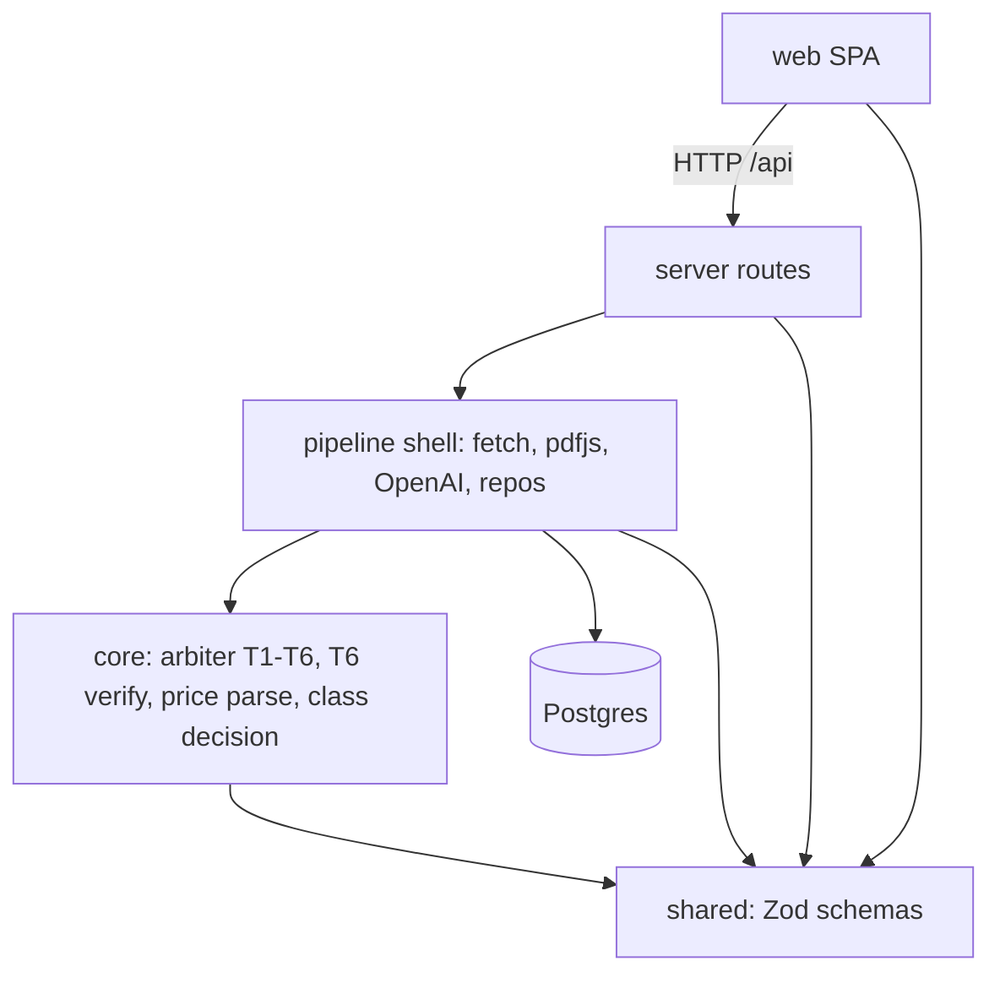
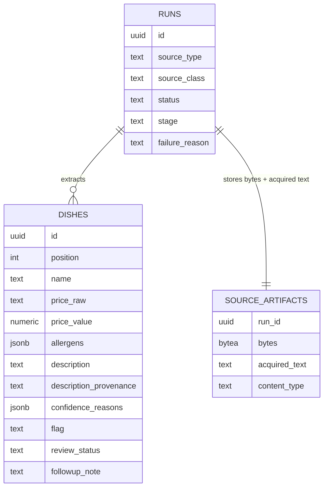

# Architecture Spine — Menu Extraction & Review

## Design Paradigm

**Functional core / imperative shell**, inside a single Fastify service. The product's
judgment — triage arbiter T1–T6, T6 evidence verification, price parsing, source-class
decision — is pure code with no IO; everything that touches the world (HTTP fetch, pdfjs,
OpenAI, Drizzle/Postgres) is shell. The SPA is a **viewer of persisted state**, never a
holder of process: runs are born in Postgres and the browser polls (persist-first, D13).



Dependency direction is a rule: `core` imports only `shared`; the shell imports `core` and
`shared`; nothing imports the shell but routes. `shared` imports nothing but Zod.

## Invariants & Rules

### AD-1 — One service, one SPA, one database `[ADOPTED]`

- **Binds:** all
- **Prevents:** a second runtime piece (worker, queue, proxy, socket server) sneaking in
- **Rule:** the only processes are the Fastify server, the Vite dev server, and Postgres
  (Docker Compose, local only). Extraction runs as an in-process promise. No queues, no
  SSE/WebSockets, no background daemons (REQUIREMENTS §4).

### AD-2 — The shared package owns the contract `[ADOPTED]`

- **Binds:** all
- **Prevents:** front and back drifting on the shape of `Dish`/`Run`; triple-declared
  schemas inside `shared` itself
- **Rule:** `shared` is the single source of contract truth: Zod schemas for entities
  (dish incl. description + its provenance, D14), API payloads, LLM output signals, the
  failure-reason enum, and the EU-14 allergen enum. **One base schema per entity; variants
  derived via `.pick()/.extend()/.omit()`, never re-declared.** `shared` has no runtime
  dependency except Zod and is consumed as TS source (no build step).

### AD-3 — Judgment is pure; IO lives in the shell

- **Binds:** FG3, FR9–FR21
- **Prevents:** triage logic entangled with infrastructure; untestable arbiter
- **Rule:** arbiter T1–T6, T6 verification, price parsing, and the class decision are pure
  functions under `server/src/core/` — no IO imports allowed there. Model output enters as
  validated data; flag + `confidence_reasons` + T6 match offsets come out.

### AD-4 — Persist-first run lifecycle `[ADOPTED]` (D13)

- **Binds:** FG1, FR3–FR8, FR35
- **Prevents:** state living in an HTTP request or the browser; timeout stacking; History
  polluted by pre-run rejections
- **Rule:** run truth is two columns: **`status`** ∈ `processing | done | failed | empty`
  (persisted terminal truth) and **`stage`** ∈ `fetching_source | extracting | validating
  | saving` (progress detail, meaningful only while `processing`). `POST /api/runs`
  creates the row and returns its id before processing starts. **Pre-run rejections
  (invalid URL E1, unsupported file E4, oversize E5) are plain 4xx responses — no run row
  is ever created.** The **only** technical timeout is the OpenAI call (~120 s); source
  fetch carries ordinary size/time caps surfacing as E2/E3 failures. Retry = new run. The
  client polls (TanStack Query); it never holds the process.

### AD-5 — Derived state is computed at read, never stored

- **Binds:** FR7, FR22, FR29
- **Prevents:** two computers of the same truth; reaper processes; golden/payload ambiguity
- **Rule:** `interrupted` (`processing` with no stage transition past the staleness
  threshold), menu `done`-ness, and review progress are derived server-side at read time —
  no column stores them, no background job maintains them. Dishes are persisted **in one
  transaction at `saving`**; a mid-run `GET /api/runs/:id` returns `dishes: []`. The AD-13
  golden freezes the completed-run payload.

### AD-6 — Source class `text | visual`, decided by ground text

- **Binds:** FG1–FG3, FR19, FR23, failure states
- **Prevents:** per-file-type branching; T6 scope drifting; the scanned-PDF hole (old E6)
- **Rule:** every run is classified once: **`text`** (URL, or PDF whose extracted text
  layer ≥ a minimum-chars threshold) or **`visual`** (image, or PDF below threshold /
  pdfjs parse error). Model input (text prompt vs vision/native-PDF), T6
  machine-verification, and the FR23 "what the system read" tab key on **class, never file
  type**. Source handling is decided by the **final content-type after fetch** (a URL
  redirecting to a PDF takes the PDF path). E6 is eliminated: scanned PDFs are `visual`,
  verified by Ana against the original. (Native PDF input web-verified 2026-08-21:
  Responses API `input_file`, current cap 50 MB/file — our 10 MB upload cap binds first.)

### AD-7 — The deterministic arbiter is dominant; normalization is pinned

- **Binds:** FG3, FR15–FR21; D4
- **Prevents:** model self-confidence leaking into the flag; two builders normalizing
  differently and producing different flags on identical data; a second quote-matcher in
  the frontend
- **Rule:** the model supplies signals only (provenance, evidence quotes,
  criteria-anchored self-flag); rules T1–T6 in code are the final arbiter (closes D4). T6
  compares quote and source text after **identical normalization of both sides, in this
  order: Unicode NFKC → lowercase → NFD → remove combining marks (`\p{M}`) → collapse
  whitespace**. Downgrades (`declared`→`inferred`) run before triage. T6 **persists the
  match offsets** into the acquired text; quote highlighting (FR23) reuses those offsets —
  the web never re-implements matching. Description provenance (`extracted | generated`,
  D14) is carried and displayed but **never enters the gate**: triage asymmetry belongs to
  allergens alone. Every fired rule is persisted in `confidence_reasons` and logged.

### AD-8 — Data ownership and artifact isolation

- **Binds:** FR23, FR29–FR31, NFR4
- **Prevents:** blob-bloated list queries; a second stateful store; ad-hoc allergen
  shapes; stored-content XSS; unstable dish ordering
- **Rule:** the server owns all writes. Three tables: `runs`, `dishes`,
  `source_artifacts` (uploaded bytes + acquired source text, own table, 1:1 with runs).
  `allergens` and `confidence_reasons` are `jsonb` on the dish row, shape governed by
  `shared` schemas. Dish order is server-assigned (`position`, extraction order); every
  reader sorts by it. Artifact bytes are **never selected in list queries** and are served
  only by a dedicated endpoint with correct `Content-Type`, `X-Content-Type-Options:
  nosniff`, accepted MIME types only; **acquired source text is served `text/plain`,
  never `text/html`**.

### AD-9 — Review mutates verdicts, never extractions — through one path

- **Binds:** FG4, FR22, FR25–FR28, FR31
- **Prevents:** the audit trail lying; delete paths appearing; batch and single review
  diverging into different endpoints
- **Rule:** all review mutation goes through **one endpoint**: `POST
  /api/runs/:id/reviews` with a batch of decisions `{ dish_id, action: confirm | followup
  | reopen, note? }` — a single review is a batch of one; reopen (FR27) is the same path.
  Review updates only review fields (status, note, decided-at timestamp). Extracted
  values are immutable after the run persists. Nothing is ever deleted — no DELETE
  endpoint exists. The route table in Conventions is **exhaustive**: no other mutation
  routes may be added without a spine update.

### AD-10 — Seriality is server truth

- **Binds:** FR8, FR35
- **Prevents:** the UI guard being the only guard; racing double-submits; the
  crashed-run permanent deadlock
- **Rule:** a run is **active** iff `status = processing` **and** its last stage
  transition is within the staleness threshold (AD-5). While a run is active, `POST
  /api/runs` returns `409`; once derived-interrupted, submission unblocks. The UI mirrors
  this state; it never owns it.

### AD-11 — URL fetch is not a proxy (SSRF guard)

- **Binds:** FR36
- **Prevents:** the URL field becoming a door into the server's network
- **Rule:** dependency-free guard: http/https only; resolve via `dns.lookup` and refuse
  private/loopback/link-local/metadata ranges (RFC1918, 127/8, 169.254/16, ::1, fc00::/7,
  169.254.169.254); re-validate on **every redirect hop**; fetch sends realistic
  browser-like headers and carries size and time caps (R-03). **DNS rebinding is a
  documented accepted residual** ("what breaks in production" material), not silently
  ignored.

### AD-12 — The OpenAI boundary is one injected seam

- **Binds:** FG2, FR9, E7, NFR2
- **Prevents:** direct SDK imports scattering; the mock and the real path diverging;
  JSON-parsing by hand
- **Rule:** one extraction adapter receives the OpenAI client as an injected dependency.
  It uses **structured outputs via `zodTextFormat` (strict JSON schema derived from the
  `shared` model-signal schema; verified working with Zod 4 on 2026-08-21)** — the current
  form of the challenge's "JSON mode" (judgment recorded in DECISIONS.md) — with the
  vision/native-PDF input for `visual`-class runs. Invalid output gets exactly one retry,
  then `failed` (E7). Model ids come from env (dev `gpt-5.6-luna`, final-eval
  `gpt-5.6-terra`, D3). The runtime extraction prompt is a **versioned file surfaced in
  `prompts/`** (R11).

### AD-13 — Exactly one test: the integration golden-master (R8)

- **Binds:** whole pipeline; CI
- **Prevents:** a smuggled test suite; a flaky OpenAI-dependent test; the arbiter losing
  coverage
- **Rule:** one Vitest integration test: POST a fixture through the real API with the
  AD-12 seam mocked and real Postgres; poll to completion; assert the normalized
  completed-run payload (AD-5) against **one golden** (ids/timestamps frozen or excluded,
  ordering by `position`). The mocked model response is crafted to fire **every rule
  T1–T6, including the T6 downgrade, plus at least one fully `reliable` row**. One
  scenario, one fixture, one golden. Evolves D4's unit-arbiter front-runner — formal
  justification in DECISIONS.md. CI `checks` job runs it against a Postgres service
  container.

### AD-14 — Failure containment: persisted state or the staleness net

- **Binds:** FG6, FR33, NFR5
- **Prevents:** crash loops on double failures; invented error states; enum spelling drift
- **Rule:** every stage transition ends in a persisted state, or its failure is caught by
  the AD-5 staleness net — the failure handler itself never throws (Postgres-down case).
  The `shared` failure-reason enum is **exhaustive and closed**:
  - pre-run 4xx, never stored: `invalid_url` (E1), `unsupported_file` (E4, incl. raw
    `.heic`), `file_too_large` (E5);
  - stored on `failed` runs: `unreachable_url` (E2), `no_usable_text` (E3),
    `model_timeout` / `model_error` / `model_invalid_output` (E7);
  - derived at read, never stored: `interrupted` (E8);
  - `empty` is a `status`, not a failure (E9).
  E6 no longer exists (AD-6). Partial extraction is not a failure (FR34).

## Consistency Conventions

| Concern | Convention |
| --- | --- |
| Naming | DB: snake_case; TS: camelCase; React components: PascalCase; files: kebab-case |
| API routes (exhaustive, AD-9) | `POST /api/runs` · `GET /api/runs` (list) · `GET /api/runs/:id` · `GET /api/runs/:id/artifact` · `POST /api/runs/:id/reviews` |
| IDs & dates | `uuid` via `gen_random_uuid()`; `timestamptz` stored UTC, serialized ISO-8601 |
| Error envelope | `{ error: { code, message } }`; codes from the AD-14 enum |
| Allergens | canonical EU-14 snake_case ids in `shared` (e.g. `gluten`, `crustaceans`); UI renders localized labels |
| SPA routing | react-router: `/` (submit), `/runs/:id` (review), `/history` — History→review is a deep link (FR30) |
| Frontend state | server state lives only in TanStack Query (polling via `refetchInterval` while active); no global client store |
| Uploads | `<input accept="image/jpeg,image/png,image/webp">` / `application/pdf` — **never `image/heic`** (Safari 17+ converts *to* HEIC when listed; exclusion triggers the OS's HEIC→JPEG auto-convert, verified 2026-08-21); raw `.heic` → `unsupported_file` 4xx |
| Waiting UI | stage name (1:1 with real transitions) + measured elapsed + static expectation copy; banned: percentage bars, dynamic ETAs, lone spinners (PRD FR4–FR5) |
| Review-screen honesty | NFR3 disclaimer always visible; flag copy "auto-checked" / "needs review", never "safe"/"verified" (FR15); allergen badges show `declared` vs `inferred`, dish-level `unknown` distinct (FR13); `generated` descriptions visibly labeled (FR12); FR20 menu-level notice above the table |
| Logging | Pino via Fastify's native logger; every stage transition and every fired T-rule logged with `run_id` (NFR5) |
| Config | env vars only, validated fail-fast at boot with a Zod schema; `.env.example` is the complete reference; no secrets in repo (D12 gitleaks CI) |

## Stack

Reference snapshot verified against the npm registry 2026-08-21. Majors are pinned by the
official scaffolds at scaffold time — never hand-upgraded (TS 7 is a fresh major: take
what the scaffold gives).

| Name | Version |
| --- | --- |
| Node.js + TypeScript | current LTS, **≥ 22.13** (pdfjs floor) / 7.0.2 (scaffold-pinned) |
| Fastify (+ @fastify/multipart) | 5.12.1 / 10.1.1 |
| Drizzle ORM / drizzle-kit | 0.45.2 / 0.31.10 |
| PostgreSQL | 16 (postgres:16-alpine, Compose) |
| React / Vite | 19.2.8 / 8.2.2 |
| Tailwind CSS / shadcn/ui | 4.3.3 / CLI 4.18.0 (components vendored) |
| TanStack Query | 5.101.4 |
| Zod | 4.4.3 |
| openai SDK | 7.5.0 (`zodTextFormat` + Zod 4 verified) |
| pdfjs-dist | 6.2.108 — needs its optional `@napi-rs/canvas` (prebuilt) in Node; **never install with `--omit=optional`** |
| Pino | 10.3.1 |
| Vitest | 4.1.11 |
| tsx / concurrently (dev) | 4.23.12 / 10.0.5 |

## Structural Seed

```text
/                          # npm workspaces (plain npm — no Nx/Turbo/pnpm)
  server/
    src/
      core/                # pure: arbiter, t6-verify, price-parse, class-decision
      pipeline/            # shell: source fetch, pdfjs text, extraction adapter (OpenAI seam)
      routes/              # Fastify routes; orchestration only
      db/                  # Drizzle schema + repos
    drizzle/               # generated SQL migrations (committed — the "real migration")
    test/                  # the one golden-master test + fixture + golden
  web/
    src/                   # pages (submit, review, history), components, api client
  shared/
    src/                   # Zod schemas: entities, payloads, model signals, enums
  prompts/                 # session prompt log + the runtime extraction prompt (R11)
  _bmad-output/            # BMAD planning + implementation artifacts (committed)
  docs/ · plan/            # challenge docs, master plan, RISKS.md
  DECISIONS.md · BUSINESS.md · README.md
  docker-compose.yml       # Postgres only
  .github/workflows/ci.yml # gitleaks (existing) + checks job (typecheck + the one test)
  .env.example
```



Operational envelope (deliberately minimal): local-only — no deploy target, no
environments beyond dev (REQUIREMENTS §4 cut, recorded). `docker compose up -d` starts
Postgres; `npm run dev` runs server (tsx watch) + web (Vite) via `concurrently`; Vite
proxies `/api` to Fastify in dev. CI (D12): gitleaks on every push; `checks` job
(typecheck + AD-13 test with Postgres service container) added when the scaffold lands.

## Capability → Architecture Map

| Capability / Area | Lives in | Governed by |
| --- | --- | --- |
| FG1 Ingestion & run lifecycle (FR1–FR8, FR35–FR36) | routes + pipeline | AD-1, AD-4, AD-5, AD-6, AD-10, AD-11 |
| FG2 Extraction contract (FR9–FR14) | extraction adapter + shared schemas | AD-2, AD-6, AD-12 |
| FG3 Triage (FR15–FR21) | core (pure) | AD-3, AD-7 |
| FG4 Review & confirmation (FR22–FR28) | routes + web review screen | AD-8, AD-9, review-screen honesty convention |
| FG5 History (FR29–FR32) | routes + web history page | AD-5, AD-8, AD-9 |
| FG6 Failure states (FR33–FR34; E6 eliminated by AD-6) | pipeline + shared enum | AD-4, AD-6, AD-14 |
| NFR2 cost envelope | extraction adapter (model ids via env) | AD-12 |
| NFR5 observability | shell logging | AD-7, AD-14, conventions |

## Deferred

Each waits for a reason; none lets two units diverge:

- **Class threshold value** (AD-6) — calibrated on dev test menus; the rule's existence is
  the invariant, the number is data.
- **Staleness threshold (3 min) and expectation copy ("30–90 s")** — measured/calibrated
  during testing (PRD open items).
- **Extraction prompt content** — build phase; its home (`prompts/`, versioned) is already
  fixed by AD-12.
- **Model params** (temperature, max output tokens) — build phase; generous
  `max_output_tokens` noted for the 400-dish truncation limit (documented known limit).
- **Drizzle column details, Fastify plugin layout, Tailwind tokens** — the code owns them
  (stock shadcn, no custom design system).
- **History pagination** — only if volume demands it (FR32).
